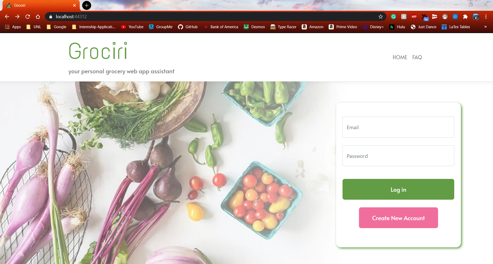

# CS361 Group10 Grocery App - Grociri

## Authors
* Bryce Yong - https://github.com/bryceyong
* Alexis Linhardt - https://github.com/lexlinhardt
* Noah Anderson - https://github.com/MindOverGame
* Ryan Hruby - https://github.com/ryanhruby
* Tomo Bessho - https://github.com/tzxb018

## Overview of Application

Login

 

When first opening the application, the user will be prompted to this login page. Here, the user can input their email and password to login. If incorrect credentials are given, the user will be prompted in the login window and will have to try again. If the user wants to create an account with a new email and password, they can select 'create a new account' and follow the prompts given there.
 

User Menu

 

After successfully logging in, the user will see their saved grocery lists. From here, they can select to view a grocery list by selecting 'view' in the corresponding row. To delete a list, they can select 'delete', which will delete the list and all the items in the list. Before deleting, the user will be asked to confirm their deletion of the list with an alert box. A user can search for a certain grocery list in the search bar by its name. To clear the search results, the user can press 'refresh'. Lastly, to create a new list, the user can select 'create new list', which will prompt them to a new page that has the user input the new list's name. After doing so, the user will be notified that the list was created and be brought back to this site. 
 

Item List

 

After selecting a grocery list from the main page, the user will be prompted to this page. Here, they can see all the items saved in the list. They have the option of adding, searching for, and deleting the items in the list. All the functionalities are the same as the main page. 
 

## How to Run Code
To run our project, git clone this repo onto your local machine. From there, open the project on Visual Studio (2019) and run the project. You should be prompted with the login page of our site. If you get an SQL exception telling you to wait, simply rerunning the project after a few seconds will solve it. Sometimes, since the Azure database is serverless, it takes a longer time to startup before the web application in order to unpause.

## Coding Checkpoints

Final Submission (11/21/2020)

 
### Overview
From the final code checkpoint to the final submission, we polished our application in a number of ways: we fixed bugs throughout our project, finished up the remaining features, implemented final testing, and added in documentation.

### Tasks
* Bryce Yong
* Alexis Linhardt
  - Implemented the Home Button in the Navigation Bar which will direct users to either the login page (if they are logged out) or the user-menu page which hosts all their available grocery lists (if they are logged in)
  - Created an authentication variable that acts as a global variable which allows for the navigation bar to check if the user is logged in or not before deciding what to display
  - Implemented the sign out funcitonality
  - Created the sign out button in the navigation bar
* Noah Anderson
* Ryan Hruby
  - Implemented and utilized a stored procedure in the GListEngine GetUserLists() method
  - Added documentation for interfaces, engines, accessors, and remaining testing classes
  - Implemented final unit tests for GetUserLists(), GetItems(), and GetGLists() in the accessor tests
  - Deleted unused files and removed code smells
* Tomo Bessho
  - Ability to use the 'enter' key to submit new item/account/list requests
  - Fixed small bugs in the UI

Final Checkpoint (11/16/2020)

 
### Overview
We were able to deliver and create a functioning grocery list application. We have an implemented login functionality and displays all the relevant informations for each user, grocery list, and grocery list items. 

### Tasks
* Bryce Yong
  - Implemented UserController
  - Implemented login verification and account creation, as well as UI components for these
  - Partially implemented navigation bar
* Alexis Linhardt
  - Updated the FAQ section to contain relevant information
  - Implemented the UI in the FAQ section to contain a background image cohesive to the main page
  - Examined code for code smells and removed unused files
* Noah Anderson
  - Implemented UserEngineTests.cs and tweaked the accessor test files to accomodate new methods/fix bugs with old methods
  - Fixed minor code smells and implemented quality of life methods in the accessors/engines
  - Added some documentation to the accessors and engines to clarify some of the more involved methods
* Ryan Hruby
  - Configured database for access by a wider range of IP addresses
  - Added new constraints to database and modified database scripts to account for this
  - Cleaned up code smells in GListEngineTests, ItemsEngineTests, and the mocked accessors
  - Added documentation to all mocked accessors as well as some to the engine tests
  - Implemented GetHashCode() methods for the Models
* Tomo Bessho
  - UI improvements to have a 'sticky' header for both the user menu and each grocery list
  - Added in validation to the grocery list names, grocery item names, and quantities
  - Implemented POST, DELETE, and GET methods for grocery items
  - Implemented relevant service to do HTTP requests for grocery items and list
  - Integrated a data service to have componenets send relevant data to each other (selected grocery list id, selected user id, etc.)

Third Checkpoint (11/2/2020)

 
### Overview
We were able to get our UI's linked together in a cohesive flow. We are now working on getting the main functionalities of the program working and getting our database connected to an Azure database instead of a local one. 

### Tasks
* Bryce Yong
  - Worked on Login functionality
  - Figure out how starter code implemented login
  - Added AspId field to GList table from IdentityUser library
* Alexis Linhardt
  - Updated the Test class to include mocked accessors for the user accessor and the items accessor
  - Implemented the ItemsEngine class
  - Had to update some of the elements in the stack to make sure the tests were working properly
* Noah Anderson
  - Designed UserAccessor.c and UserEngine.c
  - Tweaked the models and accessors so they're compatible with the database
  - Implemented methods in the Accessors/Engines for accessing Items and Lists by foreign keys
* Ryan Hruby
  - Transferred database from local hosting to Azure hosting and updated connection strings
  - Added a quantity column to the Item table and updated test data and Item accessor unit tests to account for this
  - Updated and cleaned up MockedGListAccessor and GListEngine tests
* Tomo Bessho
  - Updated UI for the user menu page that shows all the grocery lists
  - Implemented POST, DELETE, and GET http methods for grocery lists
  - Started implementing PUT http method, but that still has some bugs

Second Checkpoint (10/5/2020)

 
### Overview
After getting our feet wet with the project, we started working on setting up the database, getting the UI written, and started implementing our main methods. We each worked on specific portions of the project. Our goal is to get the grocery list functionality running before the next release and have all the UI linked to each other in the flow they are designed to operate in. 

### Tasks
* Bryce Yong
  - Created the main menu UI using cshtml
  - Created the item list menu UI using cshtml
  - Created paths for in app navigation using RouterLink from Angular
* Alexis Linhardt
  - updated the navigation bar UI
  - created FAQ page
* Noah Anderson
  - Implemented GListAccessor
  - Designed GList object
  - Re-designed Interfaces for GListAccessor/GListEngine
* Ryan Hruby
  - Created the database using a DDL script
  - Created test data and query scripts to ensure the database is working correctly
  - Created a unit test class and mock accessor for testing the GListEngine
  - Implemented unit test methods for the SortLists() method in the GListEngine
* Tomo Bessho
  * Created the UI for the list view of the different grocery lists
  * Reorganized project architecture and files of the project
  * Implemented accessor and engine methods of the items class
  * Fixed up issues in all engine, controllers, and accessor methods

First Checkpoint 

 
### Overview
We have started preliminary work on getting started with our project. We have met a few times to disucss what the overall structure and organization of the project will look like. After downloading the starter code, we all split off into our own branches and worked on our seperate tasks. We will be meeting more frequently in the future to discuss what tasks we need to do before the next checkpoint. 

### Tasks
* Bryce Yong
  * Implemented the Grocery List Model
  * Helped design the ER-Diagram for the project
* Alexis Linhardt
  * Implemented the User Engines and Accessor interfaces for future development
* Noah Anderson
  * Created the Item Models and the interfaces of the Grocery List. 
  * Designed the ER-Diagram for the project
* Ryan Hruby
  * Created the User Models
  * Helped design the ER-Diagram for the project
* Tomo Bessho
  * Started and set up the GitHub Repo with starter code
  * Started and managed the ZenHub with tasks for people to do
  * Git merged everyone's branches and resolved any conflicts when merging

